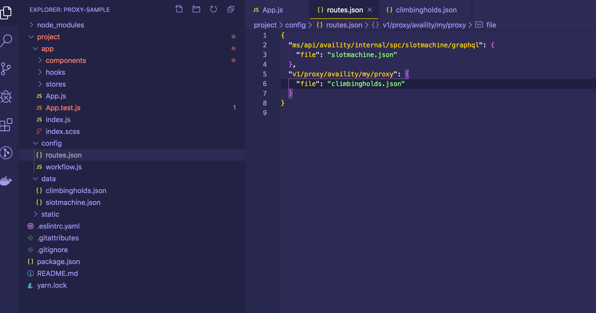
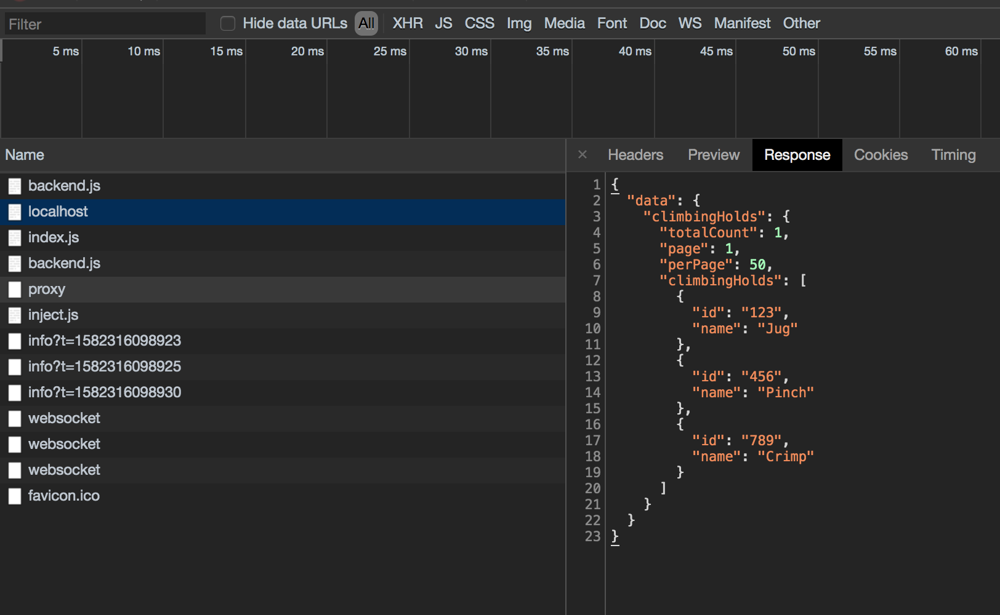

When developing Availity applications there is no use in a UI that doesn't connect to some data source. We have developed a proxy to enable you to test against real routes from other hosts from your local source.

## Creating a Project

If you are creating a new project, you can run the following command that will architect everything you need to get started. Replace `proxy-sample` with whatever your project name is.

```bash
npx @availity/workflow init proxy-sample --current-dir
```

## Proxy Data Structure



Inside of the `config` folder is a file titled `routes.json`. This contains an object `key/value` pair of all the API routes you override from your UI.

In our case, we have an API call being made that requests data from `/ms/api/availity/internal/spc/slotmachine/graphql`.

The key of the nested object is a `file` type, thus we specify its a `file` and the value is the path to the data file we want returned.

The above pictured scenario can be explained by saying "the specified path will return JSON containing the data from the file `data/slotmachine.data`. Note that the JSON will be returned for any type of request method, and parameters passed in.

## Starting proxy Server

The easiest way to know if the server is running is you should see a message saying `Ekko servered started at...`.

```shell hideCopy=true
Dev/proxy-sample/proxy-sample is 📦 v0.1.0 via ⬢ v12.16.0 took 1m44s
❯ yarn start
yarn run v1.19.2
$ av start
› REACT
› Using project/config/workflow.js
› Using @availity/workflow/public/index.html
› Using @availity/workflow/public/favicon.ico
› Webpack 0% compiling
› Webpack 10% building
› Proxy created: [ '/api', '/ms' ] -> http://localhost:60162
› Proxy rewrite rule created: "^/api" ~> ""
ℹ ｢wds｣: Project is running at http://localhost:3000/
ℹ ｢wds｣: webpack output is served from undefined
ℹ ｢wds｣: Content not from webpack is served from /Users/sstrange/Documents/Dev/proxy-sample/proxy-sample/build
ℹ ｢wds｣: 404s will fallback to /index.html
› Started development server
› Loading plugin @availity/mock-data
› Ekko server started at http://localhost:60162
› Webpack 40% building
› Webpack 50% building
› Webpack 60% building
› Webpack 70% building
› Webpack 80% basic chunk modules optimization
› Webpack 90% record hash
› Webpack 100%
› Opening browser at http://localhost:3000#/?spaceId=48C607A70B5A46A3864A34E2BDDDEA04
› Webpack stats:
```

## Example

The best way to learn is by examples and that is what we are going to do here.

We are going to clear out the `App.js` file for tesing purposes and instead paste the below code snippet.

### Adding API Code Snippet

```jsx header=App.js
import React, { useEffect } from 'react';
import { AvProxyApi } from '@availity/api-axios';

const proxyApi = new AvProxyApi({ tenant: 'availity', name: '/my/proxy' });

const fetchData = async () => {
    const response = await proxyApi.query({ sessionBust: false });
    return response;
};

const App = () => {
    useEffect(() => {
        fetchData();
    }, []);

    return <div>My name is...</div>;
};

export default App;
```

The above code snippet runs a method called `fetchData` on mount that will fetch the response from `AvProxyApi`.

Since we know the route is going go to `api/sdk/platform/v1/users/me` we need to add our proxy route in the `routes.json` by adding the following to our file:

### Adding a new Route

```json header=routes.json
{
    "ms/api/availity/internal/spc/slotmachine/graphql": {
        "file": "slotmachine.json"
    },
    "v1/proxy/availity/my/proxy": {
        "file": "climbingholds.json"
    }
}
```

All proxy routes will begin with `v1/proxy/`. You will complete the route with the `tenant` and `name` you supplied when creating a new instance of AvProxyApi. In this case `tenant` would be `availity` and the `name` would be `/my/proxy` .

### Adding Response Data

Now that we have the route we need to test out our `climbingholds.json` response:

```json header=climbingholds.json
{
  "data": {
    "climbingHolds": {
      "totalCount": 1,
      "page": 1,
      "perPage": 50,
      "climbingHolds": [
        {
          "id": "123",
          "name": "Jug"
        },
        {
          "id": "456",
          "name": "Pinch"
        }
        {
          "id": "789",
          "name": "Crimp"
        }
      ]
    }
  }
}
```

While the response we added was not simple, it is more indicative of a real response.

If you your application is currently running you will need to restart it as the proxy server will need to be restarted in order to get the updated proxy data.

To determine if your proxy is working correctly, open your browser to `localhost:3000` . Right click in the browser and select 'Inspect'. Navigate to the network tab and you should see your proxy response.



You should also see this in your terminal

```bash
GET /v1/proxy/availity/my/proxy 200 climbingholds.json
```
