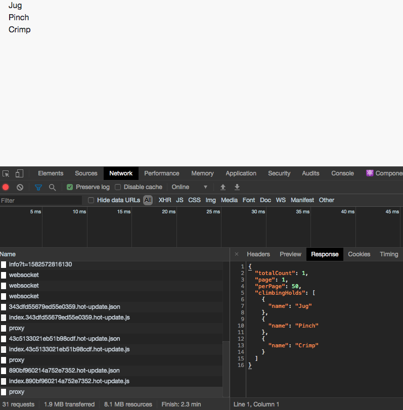

When calling out to external APIs, the portal doesn't allow traffic to come from anywhere by default. Our proxy service will map a route on our end to an external route configured by an administrator. Once that has been setup you can then begin to use the `avProxyApi` to fetch data from the external route.

## Getting Started

Most of this process is already documented [here](https://availity.github.io/availity-workflow/tutorial/mocks/), but we will do a light explanation. In the link provided you will find: how to set up your project, learn about routes for mock/proxy data, and what your terminal should look like when the server is running. Basically everything you need to know to get at least halfway out the door you will find there.

## Example

We are going to clear out the `App.js` file for tesing purposes and instead paste the below code snippet.

### Adding API Code Snippet

```javascript
import React, { useEffect, useState } from 'react';
import { AvProxyApi } from '@availity/api-axios';

const proxyApi = new AvProxyApi({ tenant: 'availity', name: '/my/proxy' });

const App = () => {
    const [climbingHolds, setClimbingHolds] = useState([]); // initialize state

    const fetchData = async () => {
        const response = await proxyApi.query({ sessionBust: false });
        setClimbingHolds(response.data.climbingHolds);
    };

    useEffect(() => {
        fetchData();
    }, []);

    return (
        <div>
            {climbingHolds.map(hold => {
                return <li key={hold.name}>{hold.name}</li>;
            })}
        </div>
    );
};

export default App;
```

The above code snippet runs a method called `fetchData` on mount that will fetch the response from `AvProxyApi`.

Since we know the route is going go to `api/sdk/platform/v1/users/me` we need to add our proxy route in the `routes.json` by adding the following to our file:

### Adding a new Route

```json header=routes.json
{
    "ms/api/availity/internal/spc/slotmachine/graphql": {
        "file": "slotmachine.json"
    },
    "v1/proxy/availity/my/proxy": {
        "file": "climbingholds.json"
    }
}
```

All proxy routes will begin with `v1/proxy/`. You will complete the route with the `tenant` and `name` you supplied when creating a new instance of AvProxyApi. In this case `tenant` would be `availity` and the `name` would be `/my/proxy` .

### Adding Response Data

Now that we have the route we need to test out our `climbingholds.json` response:

```json header=climbingholds.json
{
    "totalCount": 1,
    "page": 1,
    "perPage": 50,
    "climbingHolds": [
        {
            "name": "Jug"
        },
        {
            "name": "Pinch"
        },
        {
            "name": "Crimp"
        }
    ]
}
```

While the response we added was not simple, it is more indicative of a real response.

If you your application is currently running you will need to restart it as the proxy server will need to be restarted in order to get the updated proxy data.

To determine if your proxy is working correctly, open your browser to `localhost:3000` . Right click in the browser and select 'Inspect'. Navigate to the network tab and you should see your proxy response.

The climbing hold list should be rendered on the screen.



You should also see this in your terminal

```bash
GET /v1/proxy/availity/my/proxy 200 climbingholds.json
```
